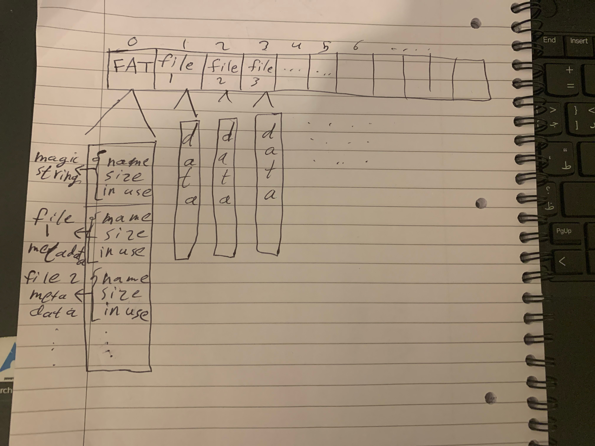

# Intro

A file system (FS) controls file organization and access. A local file system is an operating system feature that enables apps running on the same machine to access a shared mass storage. This project aims to construct a simple yet reliable file system for the Raspberry Pi Pico flash memory.

# How to use

First, clone the repository locally with the following command:

```bash
$ git clone https://gitlab.uwe.ac.uk/y2-abuhummos/cap_fs
$ cd cap_fs
```

next a build, run and view output scripts are provided, to build:

```bash
$ ./build.sh
```

to run, first make sure to unplug the pi, and plug it again with the reset button pressed then:

```bash
$ ./run.sh
```

otherwise you can drag and drop the file into the pi.

and finally to view output:

```bash
$ ./out.sh
```

# Architecture

The flash memory on the Pi is partitioned into sectors, sequentially numbered from 1 onwards. This filesystem utilizes sector 0 as a file allocation table (FAT), responsible for managing metadata such as file names, sizes, and usage status.

Additionally, an in-memory array tracks open files and their associated data, including position and mode, which will be discussed later on.

## File Allocation Table (FAT) Block

The zeroth sector, or block, within the flash memory serves as an array table of `FileEntry` structures. Each structure corresponds to a sector at its respective index, storing essential metadata. At index 0, occupied by this array, the `filename` field is repurposed to store a specific magic string: `"magic string for initializing\0"`. During filesystem initialization, if this string is absent or incorrect, this means the file system is corrupt or has not been set up before so the filesystem initializes the table and writes it back to memory. The image below illustrates how it looks like:



## Open Files Table

This table maintains a record of opened files, where each entry's index represents its file descriptor. Users interact with the system using these descriptors. An entry is deemed open when its corresponding file entry pointer is set to `NULL`.

# Implementation and Design Decisions

## Error Handling

All return types within this system are integers. A positive integer indicates success, with zero just denoting success and any value above zero representing additional information such as the number of bytes or a file descriptor. Negative values signify errors, with each error type mapped to a specific negative number within an enum. This approach enhances readability, as illustrated in the example below from `fs_create`:

```c
    // Check if file already exists
    if (get_file(path) != FILE_NOT_FOUND) {
        return FILE_ALREADY_EXISTS;
    }
```

## File Modes

File modes are defined using bitwise shifting of binary digits instead of enums. This allows for combining multiple modes using bitwise OR. For example, to open a file for both reading and writing:

```c
fs_open("file_name", MODE_READ | MODE_WRITE);
```

Bitwise OR retains all set bits:

```
0001 // read mode
    +
0010 // write mode
----
0011 // read + write mode
```

To check if a mode is applied, bitwise AND is used:

```
0101 // read + append
    &
0010 // append mode
----
0000 // append mode is not applied
```

## Create

Files in the FAT table are considered to exist if they have a non-null filename. Therefore, the create function loops over the file table to find an entry with a null filename.

## Remove

Removing a file involves setting its filename and other associated fields to null or zero.

## Format

Formatting clears the contents of the specified file stored on the flash and sets its size to zero.

## Wipe

Wiping performs a hard reset of the flash memory, clearing all sectors and resetting all file metadata in the FAT table to zero.

## Copy

The copy operation creates a duplicate of the source file in the destination, overwriting its content if it already exists or creating a new file if it doesn't. This results in two files at the end.

## Move

Similar to copy, move copies the source to the destination if it exists. However, unlike copy, it deletes the source file afterward, resulting in only one file. If the destination file doesn't exist, move simply renames the source file.

## List

The list operation is straightforward: if the file exists, it prints its metadata; otherwise, it moves on to the next entry in the FAT table.

## Open

The open function retrieves the file from the FAT table and assigns it a file descriptor based on the first available index in the `opened_files` array. Subsequent interactions with the opened file occur through this file descriptor.

## Close

Similar to removal, closing a file involves nullifying the entry in the `opened_files` array at the corresponding file descriptor index.

## Read

The read operation utilizes the `position` field. Each read operation acts as a buffer, incrementing the position by the number of bytes read. Subsequent reads or writes occur from this updated position. For instance:

```c
fs_read(1, buf, 6);
fs_read(1, buf, 6);
```

Would yield:

```
"hello " // first read
"world!" // second read
```

Internally, a pre-allocated temporary buffer is used to read file content, which is then filtered based on the `position` field into the buffer provided by the function call. This approach is necessary because the memory reading and writing methods available do not support offset within the sector itself.

## Write

The write operation has two modes, depending on how the file was opened:

### Normal Writing

In this mode, similar to reading, the position determines the write location. The provided buffer is copied into a temporary buffer, then written back to the flash memory, advancing the position accordingly. For example, if `"Hello world!"` is written to a file with a position of 3 and then `"hello"` is written again, the content becomes `"Helhellorld!"` and the position becomes 8.

### Append

In append mode, the current position is stored, the position is set to the end of the file, and the content is written there. The old position is then restored. For instance, appending `"hello"` to a file with content `"Hello world!"` at position 3 results in `"Hello world!hello"`, with the position remaining at 3.

## Seek

The seek operation manipulates the position and supports three modes:

- **SET**: Sets the position to the specified offset from the start of the file, moving forward.

  ```c
  // current position is 5, and size is 10
  fs_seek(1, 3, SEEK_SET);
  // current position is 3
  ```

- **CUR**: Sets the position to the specified offset from the current position, moving forward.

  ```c
  // current position is 5, and size is 10
  fs_seek(1, 3, SEEK_CUR);
  // current position is 8
  ```

- **END**: Sets the position to the specified offset from the end of the file, moving backward.

  ```c
  // current position is 5, and size is 10
  fs_seek(1, 3, SEEK_END);
  // current position is 7
  ```

# Memory Management

Upon initialization, all file metadata is loaded into memory for quicker access. Furthermore, these files are statically allocated, eliminating the need for dynamic memory allocation and deallocation upon create, remove, move, and copy operations. Instead, these operations simply involve setting the related name to null or vice versa.

In addition to the FAT table, there is a table to store opened files, also statically allocated. This allows for efficient reuse of indices when opening and closing files, optimizing memory usage.

Since all files are loaded into memory, users interact with file descriptors rather than pointers, preventing access to raw file metadata unnecessarily. Moreover, indexing into a list of files is achieved in constant time (`O(1)`), which is more efficient than looping to find file metadata from entries.

On the other hand, file entries are stored as pointers rather than indices. This design choice ensures that file entries remain intact even after operations like move, preserving their integrity.

# CLI

The app provides a command line interface to interact with the system, offering all commands, bellow is the set of commands:

| Command | Arguments                                    |
| ------- | -------------------------------------------- |
| open    | \<filename\> \<mode\>                        |
| close   | \<fd\>                                       |
| read    | \<fd\> \<size\>                              |
| write   | \<fd\> \<string\>                            |
| seek    | \<fd\> \<offset\> \<whence\>                 |
| ls      | -                                            |
| wipe    | -                                            |
| create  | \<filename\>                                 |
| rm      | \<filename\>                                 |
| format  | \<filename\>                                 |
| mv      | \<old_filename\> \<new_filename\>            |
| cp      | \<source_filename\> \<destination_filename\> |
| test    | -                                            |
| exit    | -                                            |

## Tests

A dedicated set of unit tests has been written to ensure the functionality of the commands. You can run these tests using the following methods:

1. **CLI Command:** Execute the test command through the CLI.

   ```bash
   Enter command: test
   ```

2. **Function Call:** Alternatively, you can directly call the `run_tests()` function.

   ```c
   run_tests()
   ```
